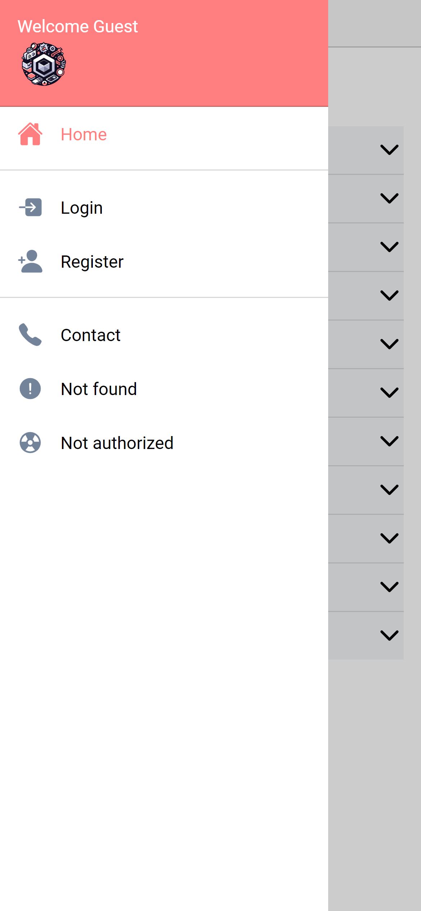

<h1 align="right">
  
  Ionic + Vue + Capacitor = 💖
</h1>

  Um simples modelo de aplicativo Ionic, utilizando o framework VueJS e Capacitor. Ele traz uma estrutura de pasta simples e alguns componentes.
    
  

 

## 👀 Visão Geral

  
  
  
  

 

> **Nota**
>
> Dê uma olhada em https://pferreirafabricio.github.io/ionic-vue-boilerplate para um teste ao vivo. OBS: Não se esqueça de pressionar F12 e alternar a emulação de dispositivo para visualizá-lo na visualização móvel.

> **Nota**
>
> Se preferir, você pode baixar o arquivo .apk na [página de lançamentos](https://github.com/pferreirafabricio/ionic-vue-boilerplate/releases)

## 📖 Sobre

Este projeto é um boilerplate para construir aplicativos móveis usando Ionic e Vue. Ele inclui uma variedade de componentes e recursos, como uma tela de login, uma tela inicial e alguns componentes de interface do usuário.

## 🧱 Este projeto foi construído com

- [Ionic](https://ionicframework.com/)
- [Ionic + Vue](https://ionicframework.com/vue)
- [Capacitor](https://capacitorjs.com/)
- [Vue](https://vuejs.org/)
- [Pinia](https://pinia.vuejs.org/)

## 🏃🏻‍♂️ Instalação e Execução

1.  Clone este repositório `https://github.com/pferreirafabricio/ionic-vue-boilerplate.git`
2.  Entre na pasta do projeto: `cd ionic-vue-boilerplate`
3.  run `cp .env.example .env`
4.  run `npm install`
5.  run `npm run serve` ou `npm run dev`
6.  Acesse `http://localhost:8080` no seu navegador e seja feliz 😃

## ♻ Contribua

1.  Faça um fork deste repositório
2.  Crie um branch com sua funcionalidade: `git checkout -b minha-feature`
3.  Commit suas alterações: `git commit -m 'feat: Minha nova funcionalidade'`
4.  Envie seu branch: `git push origin minha-feature`

## 🧾 Licença

Este projeto está sob a licença MIT. Consulte o arquivo [LICENSE](LICENSE) para mais detalhes.

## 📚 Saiba mais

- Documentação do Ionic Vue: https://ionicframework.com/docs/vue/overview
