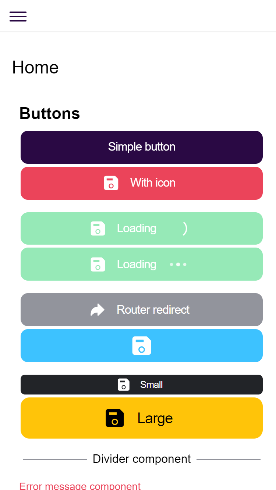
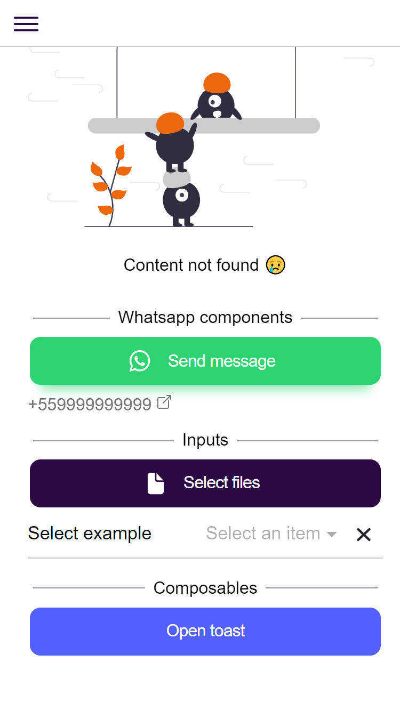
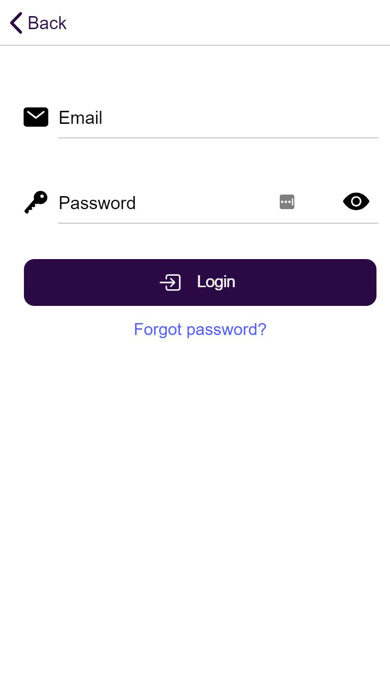

<h1 align="right">
  
  Ionic + Vue + Capacitor = 💖
</h1>

  <!-- License -->
  

 

## :eyes: Overview

  
  
  

 

> **Note**:
> Take a look in https://pferreirafabricio.github.io/ionic-vue-boilerplate for a live test. OBS: Don't forget to press F12 and toggle device emulation.

> **Note**:
> If you prefer you can download the .apk file in the [releases page](https://github.com/pferreirafabricio/ionic-vue-boilerplate/releases)

## :open_book: About

This project is a simple Ionic app template, using VueJS framework and Capacitor. It brings a simple folder structure and some components.

## :bricks: This project was built with:

- [Ionic](https://ionicframework.com/)
- [Ionic + Vue](https://ionicframework.com/vue)
- [Capacitor](https://capacitorjs.com/)
- [Vue](https://vuejs.org/)
- [Bootstrap Utilities for layout](https://getbootstrap.com/docs/4.0/layout/utilities-for-layout/)

## :running_man: Installing and Running

1.  Clone this repository `https://github.com/pferreirafabricio/ionic-vue-boilerplate.git`
2.  Enter in the project's folder: `cd ionic-vue-boilerplate`
3.  Run `npm install`
4.  Run `npm run serve`
5.  Access `http://localhost:8080` in your browser and be happy 😃

## :recycle: Contribute

1.  Fork this repository
2.  Create a branch with your feature: `git checkout -b my-feature`
3.  Commit your changes: `git commit -m 'feat: My new feature'`
4.  Push your branch: `git push origin my-feature`

## :page_with_curl: License

This project is under the MIT license. Take a look at the [LICENSE](LICENSE) file for more details.

## 📚 Learn more

- Ionic Vue Docs: https://ionicframework.com/docs/vue/overview
